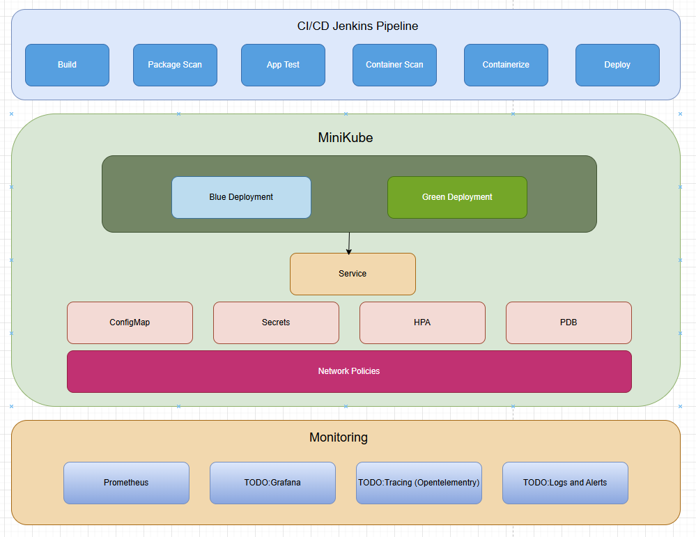

# Case Study Project

This repository contains a Jenkins CI/CD pipeline for a simple Express.js application with containerization, blue/green deployment strategy with canary testing with monitoring.


## Table of Contents

- [Overview](#overview)
- [Architecture](#architecture)
- [Local Development Setup](#local-development-setup)
- [Deployment Pipeline](#deployment-pipeline)
- [Kubernetes Configuration](#kubernetes-configuration)
- [Monitoring & Observability](#monitoring--observability)
- [Security Features](#security-features)
- [Troubleshooting](#troubleshooting)

## Overview

This project includes a DevOps workflow including:

- A simple Node.js/Express.js application with health monitoring
- Containerization using Docker with multi-stage builds
- CI/CD pipeline using Jenkins
- Blue/Green deployment with Canary testing on Kubernetes (Minikube)
- Monitoring and metrics exposure with Prometheus
- Security scanning for dependencies and container images

## Architecture

### Application Layer

The application is a simple Express.js server that provides:
- Basic REST API endpoints
- Health and readiness checks
- Prometheus metrics export

### CI/CD Pipeline

The Jenkins pipeline automates:
1. Building the application
2. Running tests
3. Security scanning for dependencies and code
4. Building and scanning Docker containers
5. Deployment of Kubernetes resources such as services and configmap/secrets.
6. Deployment to Kubernetes with blue/green strategy
8. Rollback capability if issues are detected
9. Success/Error notifications.

### Kubernetes Deployment

The application runs on Kubernetes with:
- Blue/green deployment strategy
- Horizontal Pod Autoscaler for automatic scaling
- Pod Disruption Budget for high availability
- ConfigMaps and Secrets for configuration
- Network policies for enhanced security

## Development Setup

### Prerequisites

- Node.js 18 or higher
- Docker Desktop
- Minikube
- kubectl
- Jenkins (for full CI/CD pipeline)
- If Jenkins deployed as built-in node (it is for this project) please check whether your JDK/JRE is compatible with Jenkins.

### Setting Up Environment

1. **Fork Clone Project**

   ```bash
   git clone https://github.com/yourusername/erenyigit-application.git
   cd erenyigit-application
   ```

2. **Install Jenkins to your machine**

   ```bash
    # Update Ubuntu
    apt-get update
    apt-get -y install apt-transport-https ca-certificates curl gnupg-agent software-properties-common
    apt-get update
    ```
    Install Java and Jenkins (!!Please check compatibility issues with Jenkins)

    ```bash
    sudo apt install openjdk-11-jre-headless
    wget -q -O - https://pkg.jenkins.io/debian-stable/jenkins.io.key | sudo apt-key add
    sudo bash -c 'echo deb https://pkg.jenkins.io/debian-stable binary/ > /etc/apt/sources.list.d/jenkins.list'
    sudo apt update
    sudo apt-get install jenkins
    # Add Jenkins to docker group
    sudo usermod -a -G docker jenkins
    sudo service jenkins start
    ```

    Access it via http://localhost:8080/
    get initial password from

     ```bash
    sudo cat /var/lib/jenkins/secrets/initialAdminPassword
    ```
    Setup admin password and configure plugins.
   

3. **Configure Jenkins**

   - Install Kubernetes CLI plugin
   - Install NodeJS plugin (this step is redundant if you are able to run your jenkins in a node alpine or any other container that is node already installed)
   - Setup a credential via KubeConfig File/Token/CA. Token is being used for this project.
   - Edit/Implement your credential in the jenkins pipeline.
   - Create a Pipeline and select Pipeline script from SCM and paste repository URL. 
   - Authentication is not necessary for public repos, make sure to add authentication credentials to jenkins vault if your repository is private.

4. **Configure Minikube**

    Install Minikube

   ```bash
    curl -LO https://storage.googleapis.com/minikube/releases/latest/minikube_latest_amd64.deb
    sudo apt install ./minikube_latest_amd64.deb -y
    rm minikube_latest_amd64.deb
   ```

   Configure minikube resource flags to your requirements if you are using WSL with docker backend you need to define a port mapping for being able to health check your application.
   You also need to enable insecure-registry access to port 5000 if you are going to use minikube local registry (ref:https://github.com/kubernetes/minikube/issues/15631).
   
    ```bash
        minikube start --cpus 2 --memory 4096 --insecure-registry="localhost:5000" --ports=127.0.0.1:30080:30080
    ```

    Setup Minikube registry (ref: https://minikube.sigs.k8s.io/docs/handbook/registry/)

    ```bash
    minikube addons enable registry
    #Confirm registry addon is exposed at port 80
    kubectl get service --namespace kube-system
    kubectl port-forward --namespace kube-system service/registry 5000:80

    #From this point we can (ab)use docker’s network configuration to instantiate a container on the docker’s host, and run socat there to redirect traffic going to the docker vm’s port 5000 to port 5000 on your host workstation.

    docker run --rm -it --network=host alpine ash -c "apk add socat && socat TCP-LISTEN:5000,reuseaddr,fork TCP:host.docker.internal:5000"
    ```

    Give access to the jenkins user for making sure it can access to the kubectl or better create a simlink for it.

    ```bash
        /etc/default/jenkins
        PATH="/usr/local/bin:/usr/sbin:/usr/bin:/sbin:/bin" 
        # or
        sudo ln -s /usr/local/bin/kubectl /usr/bin/kubectl
    ```

    Configure kubecontext or token for jenkins access for token aproach: 

    ```bash
        kubectl create serviceaccount jenkins -n default
        #Give it cluster admin privileges (use more restricted roles in production)
        kubectl create clusterrolebinding jenkins-cluster-admin \
        --clusterrole=cluster-admin \
        --serviceaccount=default:jenkins

        TOKEN=$(kubectl create token jenkins -n default)
        echo $TOKEN
    ```

    Now you are able to use MiniKube registry and push your containers into it.

    Simply run your jenkins job and enjoy your application.


## Deployment Pipeline

### Jenkins Pipeline Stages

1. **Build**: Compiles the application and installs dependencies
2. **Test**: Runs unit and integration tests
3. **Security Scan - Dependencies**: Scans dependencies for vulnerabilities
4. **Containerize**: Builds Docker image
5. **Security Scan - Container**: Scans Docker image for vulnerabilities
6. **Push to Registry**: Pushes image to container registry
7. **Deploy to Kubernetes**: Deploys to inactive environment (blue or green)
8. **Test New Deployment**: Runs health checks against new deployment
10. **Switch Traffic**: Switches all traffic to the new deployment
11. **Cleanup**: Scales down the old deployment


## Kubernetes Configuration

### Resource Configuration

- `deployment.yaml`: Defines pod specification with precise resource requests/limits
- `service.yaml`: Exposes the application and handles traffic routing
- `hpa.yaml`: Horizontal Pod Autoscaler for automatic scaling
- `pod-disruption-budget.yaml`: Ensures high availability during disruptions
- `network-policy.yaml`: Restricts network traffic for security
- `configmap.yaml`: Stores non-sensitive configuration
- `secret.yaml`: Stores sensitive configuration data

## Monitoring & Observability

### Prometheus Metrics

The application exposes metrics at `/metrics` including:
- HTTP request counts and durations
- Memory and CPU usage
- Application-specific metrics
- Node.js runtime metrics


## Troubleshooting

### Reminders

- If you are using WSL or you are hosting your jenkins in Windows please make sure to add following flags to the minikube
    ```bash
       --insecure-registry="localhost:5000" --ports=127.0.0.1:30080:30080
    ```
- Without these flags there will be problem while accessing to the application and also when jenkins trying to push builded containers into registry.
- For kubectl related issue please check credentials/tokens. If you are using CA's make sure jenkins user has read access to these CA's.
- There can be firewall issues related to Windows, you can disable WSL specific firewall if you are experiencing it.
- Make sure to add jenkins user to docker group.

### Common Issues

#### Application Doesn't Start

**Symptoms**: Container failing to start or crashing immediately

**Solutions**:
- Check logs: `kubectl logs deployment/devops-app-$color`
- Verify ConfigMap is properly mounted: `kubectl describe pod -l app=devops-app`
- Ensure required environment variables are set

#### Health Checks Failing

**Symptoms**: Pod in CrashLoopBackOff state or failing readiness probes

**Solutions**:
- Examine health endpoint: `kubectl port-forward deployment/devops-app-blue 3000:3000` then `curl localhost:3000/health`
- Check resource constraints: `kubectl describe pod -l app=devops-app` to see if pods are being OOM killed
- Verify network connectivity if accessing external dependencies

#### Jenkins Pipeline Failures

**Symptoms**: Pipeline fails at a specific stage

**Solutions**:
- **Build failures**: Check if dependencies are available and Node version is correct
- **Security scan failures**: Review scan results for actual vulnerabilities vs. false positives
- **Deployment failures**: Verify Kubernetes configuration and credentials

#### Blue/Green Deployment Issues

**Symptoms**: Traffic not routing correctly or deployment not fully switching

**Solutions**:
- Check service selector: `kubectl describe svc devops-app`
- Verify both deployments are running: `kubectl get deployments -l app=devops-app`
- Check canary service configuration if using: `kubectl describe svc canary-service`

### Debugging Commands

```bash
# Get all resources related to the app
kubectl get all -l app=devops-app

# View pod logs
kubectl logs -l app=devops-app,color=blue

# Check pod details
kubectl describe pod -l app=devops-app,color=blue

# Verify ConfigMap content
kubectl get configmap devops-app-config -o yaml

# Port forward to access application directly
kubectl port-forward deployment/devops-app-blue 3000:3000

# Check HPA status
kubectl get hpa devops-app-blue-hpa

# View network policies
kubectl get networkpolicy

# Check Prometheus metrics
curl localhost:3000/metrics
```

## Further Improvements:

- If we need to opt in for a local repository proper security measures should be arranged for secure connection or we can opt-in for a remote repository provider such as ECR/Docker.io
- Applications should be deployed to different nodes with node affinities, taint/toleration settings.
- Monitoring/Logging/Tracing solutions should be implemented and improved.
- Monitoring and Logging solutions should be placed inside DaemonSets with proper configurations with attached volumes.
- After health check success rollout should be in a canary form with a predefined weight.
- Proper authentication and authorization mechanisms should be implemented for more sofisticated applications and use cases.